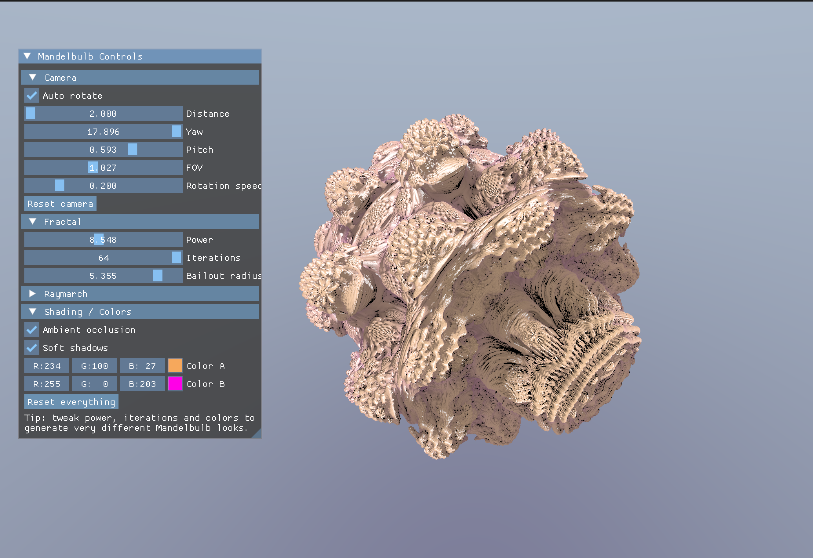

# FractalOS

My attempt on GPU-Accelerated 3D fractals (Mandelbulbs) rendering made in C/C++ and ImGUI. Still kind of slow, but looks cool.

[Click me for information on what Mandelbulbs are.](https://en.wikipedia.org/wiki/Mandelbulb)

Examples of the variety of mandelbulbs that can be generated:

